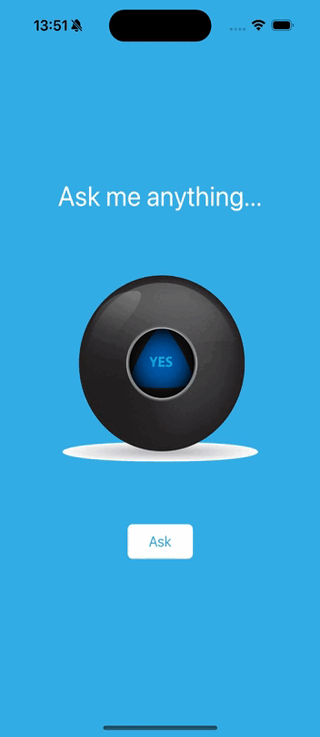

#  Magic 8 Ball Swift App

## What was do in this app

Make a Magic 8 Ball app. You can ask the app to make all your hard decisions! With this app in your pocket, you’ll always have an answer to life’s many conundrums!

## What was used to make this app

* The Swift Programming Language
* Storyboard
* Collection Types - Arrays
* UI elements such as UILabel, UIButton, UIImageView, UIStackView

## Example what the application do

